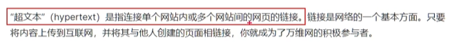

# HTML学习笔记
## 目录
- [基础概念](#基础概念)
- [扩展知识](#扩展知识)
- [实用提示](#实用提示)
- [SEO相关知识](#SEO相关知识)
- [meta元信息](#meta元信息)
- [块级元素与行内元素](#块级元素与行内元素)
- [HTML标签](#HTML标签)
- [常见问题](#常见问题)

## 基础概念
- HyperText Markup Language
- 超文本：`超`的含义 -> 超链接
	
## 扩展知识
- 学习一门编程语言前先搞懂所有相关英文
- 编程思维 : 量化每一步的思维
- 产品思维 : 刚需 用户体验(培养用户的懒习惯) 用户粘性
- 开发理念 : 结构 样式 行为分离
- 域名 -> DNS解析 -> 物理地址
- 为什么需要文档声明? 大多数浏览器默认渲染最新标准
- 字符编码 默认 UTF-8
- LiveServer会帮你纠正字符编码
## 实用提示
- 修改输入法：中文模式下用英文符号
- F11 全屏切换
- SHIFT + 刷新 -> 强制刷新
- 使用 ! +Tab/Enter 快速生成HTML基础结构
- F12打开开发者工具调试
## SEO相关知识
- 百度税：一半来自医院，中国最大的广告商
- 如何收费:IP段锁定：考察生物行为是否恶意，一个IP多少钱
- SEO：符合爬虫喜好，符合搜索引擎喜好
- 权重：权重高的网页排名越靠前
## meta元信息
- 位置: head中
- 常用属性:
	- `name`
	- `content`
	- `charset`
	- `http-equiv` : 告知浏览器如何解析文档, 相当于告诉浏览器以什么版本解析
- 功能:
- 1. 描述网页的信息, 搜索引擎会根据meta信息来确定网页的排名
```html
  	<!-- 搜索引擎优化 -->
    <meta content="关键词" name="keywords"> 
    <meta content="描述" name="description"> 
	<meta content="作者" name="author">
```
- 2. 告知浏览器以什么版本解析
- 
	```html
	<meta charset="UTF-8">
	```
- 3. 告知浏览器以什么版本解析	
- 
	```html
	<meta http-equiv="X-UA-Compatible" content="IE=edge">
	```
- 4. 保证页面在移动端的显示效果, 根据设备的宽度来缩放页面
    - 格式: `<meta content="width=device-width, initial-scale=1.0" name="viewport">`
    - `width=device-width` : 以设备宽度来渲染页面
    - `initial-scale=1.0` : 以1倍比例来渲染页面
- 5. 爬虫
### HTMl全局属性
- `id`
- `class`
- `style`
- `title`
- `lang`
- `dir`
- `hidden`
## 块级元素与行内元素
- 块级元素 : 独占一行
- 行内元素 : 不独占一行
- 规则: 块级元素可以嵌套行内元素,但行内元素不可嵌套快级元素
## HTML标签

### HTML标签的概念
- 标签: 英文单词, 尖括号 <> 组成, 用来描述文档的结构, 语义化标签
- 标签分类:
	- 双标签: 有开始标签和结束标签
	- 单标签: 只有一个标签, 没有结束标签
- 标签嵌套
- 容器: 结构化 捆绑操作,方便
- 父子结构: 目录 导航栏  可维护性
- 语义化-可维护性-可读性

### 基础标签
h1-6 标题标签 (header)
p 段落
strong 加粗
em 斜体
del 中划线
address 地址标签 斜体,独占一行
span 不分行 容器 结构化 捆绑操作,方便
div 分行 容器 结构化 捆绑操作,方便
br 换行符
hr 单行线

空格/回车 :文字分割符,不代表空格,无关数量;

### 字符实体 html编码(类似于转义符):
	 `&lt;`   	`<`
	 `&gt; `  	`>`
	 `&nbsp;`   `空格`

### 列表
#### 有序列表 order list
```html
<ol type="A" reversed="reversed" start="2">
	<li>
		了不起的盖茨比
	</li>
</ol>
```
`type` : A(大写英文字母) I(大写罗马数字) 1(阿拉伯数字) a i

#### 无序列表 unorder list

```html
<ul type="square">
	<li>草莓</li>
	<li>苹果</li>
	<li>橘子</li>
</ul>
```

`type` : square circle disc

#### 自定义列表 definition list

```html
<dl type="">
	<dt>
		<dt>
		<dd>
	</dt>
</dl>
```
- 其中 dt 是标题 dd 是文本

### 表格标签:

```html
<table border="1" width="500px" height="500px" cellspacing="10px">
	<caption>人员表</caption>
	<tr>
		<th>姓名</th>
		<th>年龄</th>
	</tr>
	<tr>
		<td>张三</td>
		<td>18</td>
	</tr>
	<tfoot>
		<tr>
			<td>总结</td>
			<td>2人</td>
		</tr>
	</tfoot>
</table>
```
- `border` : 边框 只能控制外部边距
- `th` : 表头
- `td` : 单元格
- `tr` : 行
- `caption` : 表格标题
- 合并单元格
  - `rowspan` : 跨行合并
  - `colspan` : 跨列合并

### img图片标签:
```html
	
```
- `src` : 图片的路径
  - 1 网络url 
  - 2 本地相对路径 
  - 3 本地绝对路径

- 图片的格式
  - `jpg` 有损压缩 支持的颜色丰富 占用空间较小 不支持透明背景 不支持动态图
  - `png` 无损压缩 不支持动态图
  - `bmp` 不进行压缩 不支持透明背景 不支持动态图 (网页不常见,游戏使用较多)
  - `gif` 支持简单的透明背景 支持动态图 只支持256种颜色 
  - `webp` 
    - 支持有损压缩 无损压缩 支持透明背景 支持动态图 
    - 但是兼容性不好: 如IE不可以展示
    - 解决兼容性问题: 利用js判断
  - `base64` 二维码之类的
  
### a标签 
- 1 超链接 2 anchor 锚点 3 打电话/发邮件 4 协议限定符
```html
<!-- 超链接 -->
<a href="example.com" target="_blank_">xxx</a>
<!-- 锚定跳转 -->
<a href="#id">xxx</a>
<!-- 跳转应用 -->
<a href="tel:captain_phone_number">给captain打电话</a>
<a href="mailto:captain_email">给captain发邮件</a>
<a href="sms:10086">给captain发短信</a>
<!-- 触发JavaScript代码 -->
<a href="javascript:while(1){alert('让你手欠')}">你点我试试</a>
```
- `target` 是否新标签页
- `#id` 锚定跳转本页id内容的区域 回到顶部/页面内目录导航的功能实现

### form 表单标签
```html
<form method="get" action="http://localhost:3000/login">

	username:<input type="text" name="username" placeholder="请输入你的用户名">
	password:<input type="password" name="password" placeholder="请输入你的密码"> <!--不显示输入,只对用户不可见,心理安慰-->

	你选择ABCD哪一个?(单选)
	<input type="radio" name="ans" value="A">A <!--单选框,name要一致-->
	<input type="radio" name="ans" value="B">B <!--单选框-->
	<input type="radio" name="ans" value="C">C <!--单选框-->
	<input type="radio" name="ans" value="D">D <!--单选框-->

	你喜欢吃的水果有(可多选):
	<input type="checkbox" name="fruit" value="apple">apple
	<input type="checkbox" name="fruit" value="banana">banana
	<input type="checkbox" name="fruit" value="orange">orange

	你的性别是?(单选) <!--默认选中操作-->
	<input type="radio" name="gender" value="male" checked ="checked">male
	<input type="radio" name="gender" value="female">female

	<h1>你所在的省份是:</h1>
	<select name="province">
		<option>北京</option> <!--无需映射则可省略value-->
		<option selected=true>上海</option>
		<option value="guangdong">广东</option> <!--如果需要映射那么在value里定义传参的真实值-->
	</select>

	<input type="submit"> <!--提交表单-->

</form>
```
- `value` : 选项的值
- `name` : 选项的名称
- `placeholder` : 占位符
- `type` : 文本框类型
- `method` : 表单提交方式
- `action` : 表单提交地址
- `submit` : 提交表单
- `reset` : 重置表单
- `checkbox` : 复选框
- `radio` : 单选框
- `select` : 下拉选择框
- `option` : 下拉选择框选项
- `textarea` : rows clos 给框的初始宽高
- `disabled` : 禁用文本框
- `lable` : 获取焦点,实现关联
- `fieldset` : 定义表单域
- `legend` : 定义表单域的标题
- `checked` : 输入控件的默认选中
- `disabled` : 输入控件的禁用
- `required` : 输入控件的必填
- `readonly` : 输入控件的只读
- `min` : 输入控件的最小值
- `max` : 输入控件的最大值
- `step` : 输入控件的步长
- `size` : 输入控件的宽度
- `list` : 输入控件的列表
- `autofocus` : 输入控件的自动获取焦点


### 注释
- 注释不会显示在浏览器中, 用于解释代码的作用, 提高代码的可读性,方便调试
- 注释的快捷键: Ctrl + /
- 注释不可以嵌套

### 框架标签
- 可嵌入网页 可嵌入广告 可嵌入其他内容(图片,压缩包,pdf等文件)
- 与 超链接标签或表单 的 `target` 联动
- `frame` : 框架标签
- `frameset` : 框架集标签
- `iframe` : 内框架标签
- `noframes` : 无框架标签

```html
	<iframe src="https://www.baidu.com" width="500px" height="250px"></iframe>
```

### 不常用标签
```html
    <bdo dir="rtl">这句话反着说是?</bdo>
    <code>int i = 1;
    </code>
    <var>let a = 10;</var>
    <b>加粗</b>
    <small>变小</small>
    <u>错误的内容</u>
    <q>短引用</q>
    <blockquote>常引用</blockquote>
    <address>地址</address>
```

## 常见问题
