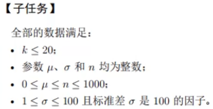

## 1. 正态分布问题解析

### 1.1 题目分析

特别注意：题目中提到标准差q满足1 ≤ q ≤ 100，且q是100的因子，这意味着数学上计算结果应该是精确的两位小数。


### 1.2 初始解决方案（80分）

最开始尝试的代码只能获得80分，问题出在浮点数精度处理上：

```cpp
#include<iostream>
#include<cmath>
using namespace std;

int main() 
{
    int k; // 测试用例数量
    cin >> k;
    while(k--) 
    {
        double u, q, n; // 均值、标准差、数值
        double Z; // Z值
        cin >> u >> q >> n;
        Z = (n - u) / q; // 计算Z值

        // 直接使用floor函数截断，存在精度问题
        int i = static_cast<int>(std::floor(Z*10)) + 1;  // 十位数字处理
        int j = static_cast<int>(std::floor(Z*100)) % 10 + 1; // 个位数字处理

        cout << i << " " << j << endl;
    }

    return 0;
}
```

### 1.3 问题分析

为什么初始代码只能得到80分？主要原因是：

1. **浮点数精度问题**：由于二进制存储的限制，某些十进制小数（如1.25）在计算机中可能会存储为近似值（如1.249999...）
2. **直接截断导致错误**：使用`floor()`函数会直接截断小数部分，当遇到上述精度问题时，会导致计算结果偏差
3. **例如**：如果实际值应该是125，但由于存储误差变成了124.999999，直接截断会得到124而不是125


### 1.4 优化方案一：使用四舍五入函数

通过使用`round()`函数对Z值乘以100后的结果进行四舍五入，可以有效解决浮点数精度问题：

```cpp
#include<iostream>
#include<cmath> 
using namespace std;

int main() 
{
    int k;
    cin >> k;
    while(k--) 
    {
        double u, q, n;
        double Z;
        cin >> u >> q >> n;
        Z = (n - u) / q; // 计算Z值
        
        // 使用round函数对Z*100进行四舍五入，避免精度误差
        int num = static_cast<int>(round(Z * 100));

        int i = num / 10 + 1;  // 十位数字处理
        int j = num % 10 + 1;  // 个位数字处理

        cout << i << " " << j << endl;
    }

    return 0;
}
```

### 1.5 优化方案二：使用字符串流处理

另一种解决方案是使用字符串流来格式化输出，这样可以确保四舍五入的准确性：

```cpp
#include<iostream>
#include<sstream>
#include<iomanip>
using namespace std;

int main() 
{
    int k;
    cin >> k;
    while(k--) 
    {
        double u, q, n;
        double Z;
        cin >> u >> q >> n;
        Z = (n - u) / q; // 计算Z值

        // 使用stringstream进行格式化输出，设置为固定精度0位小数
        std::stringstream ss;
        ss << std::fixed << std::setprecision(0) << Z*100;
        std::string numStr = ss.str();

        // 将格式化后的字符串转换为整数
        int num = std::stoi(numStr);

        int i = num / 10 + 1;  // 十位数字处理
        int j = num % 10 + 1;  // 个位数字处理

        cout << i << " " << j << endl;
    }

    return 0;
}
```

### 1.6 总结

处理浮点数计算时，精度问题是一个常见的陷阱。在本题中，两种优化方案都能有效解决问题：

1. **使用round函数**：直接对浮点数进行四舍五入操作，简洁明了
2. **使用字符串流**：通过格式化输出转换为字符串再处理，更加灵活

两种方案各有优势，实际应用中可以根据具体需求选择合适的方法。