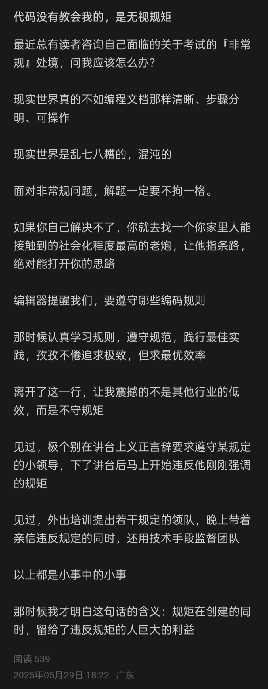

## 计算机最需要的能力是快速学习掌握新技术的能力
    还没开始工作呢，上实验课，做项目打比赛就感觉到了技术的繁杂，更新迭代之快
    学吧，一学一个不吱声

## 做一个self—motivated，而不是旁观者
    大学的学习如果按学期为单位，反馈的周期过长，导致没有学习的驱动力
    大部分成为了“旁观者”，实际上并不能完整实操
    自我驱动：
    - 主动敲代码
    - 参与开源项目
    - 参加竞赛
    - 主动学习新技术
    - 主动分享知识
    - 主动向他人请教
    这样的驱动，才能真正提高自己的能力，而不是被动地等待别人的指令。

## 不是先学好了再干，而是干起来再学习，干就是学习

    不是先学好了再干，而是干起来再学习，干就是学习  --毛泽东

    最近又要开始做项目了，知识学爆
    果然有需求才能高效学习，干中学

## 学C++ 认准大神Cherno

    以前看cs学习指南的时候，上面全是英语教程
    现在沉浸式观看了Cherno的C++教学，瞬间觉得以前的自己太傻了

## 断掉WIFI,拥抱热点

    最近由于网络问题下载不了Pytorch GPU版本
    于是把网络切换为了手机热点，畅通无阻

## “代码没有教给我的，是无视规矩”

    “规矩在创建的同时，留给了违反规矩的人巨大的利益”

## 不要犯错误

[来源](https://www.studycpp.cn/basic/chapter3/avoid-problem)  

## 关于AI

    对于人类来说，AI始终是一个工具。 但是在什么社会地位，你去利用这个工具。 你是企业家，AI肯定能够给你减少很多重复性，概念性，复杂繁琐的工作内容，变得有序，具有一定的逻辑，肯定会替换掉这一类岗位上的人，但是最终决策依然是人。 因为社会依旧是人的社会，出发点都是从人考虑为主。 AI不会完全替代人类，但是会变成衡量价值的工具。
    