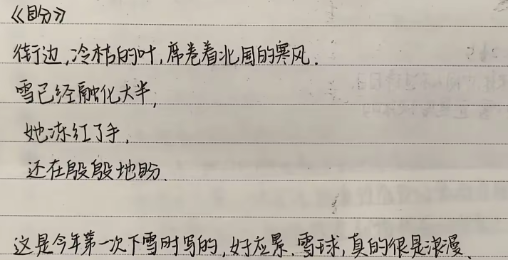
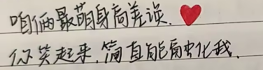
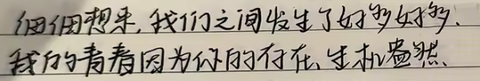
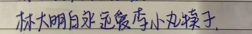
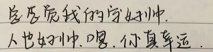
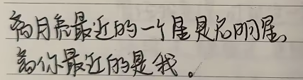
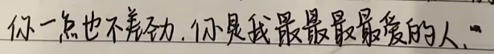

# 2025年5月31日 端午节

今天某人要看小作文,第一眼看到这条消息内心很紧张
感觉像久不跑步却要测一千米前的腿软心慌
因为感觉刻意地写小作文会很犯难,灵感才能使我滔滔不绝
于是，寻找灵感:灵机一动，原来"小作文"本身就是灵感

高中的时候经常给她写小纸条，当初一天见不了一次面都会很落寞，好不容易见到她之后会给她塞很多小零食，或者直接给她一大袋子零食。小馋鬼！我的手段！

说起见面送东西，高中阶段她送给我最好的礼物大概是在2021年12月25日的雪天
她把雪握成球状，放在塑料袋里送给我，很浪漫
雪很快就会融化，但那一日的喜悦会在每一次回忆里无限次浮现

说说写小纸条的事情吧，都说"痛苦会使人才华横溢"，那"一日不见，如三秋兮"的想念，大概也是莫大的痛苦

当时写小纸条疯狂到自习课，语文课，英语课，课间，一有感觉就去写

写小纸条大概是高中阶段最大的兴趣爱好吧哈哈

2022年6月，自她高考结束之后，基本都没有再写过小纸条了，都是下课的十分钟课间（实际被压缩到一半）里疯跑着去抢公用电话，打电话宣泄思念，直到上课铃响起再跑回教室

电话卡20一张，基本都会五张五张地买。高考结束后，我们收获了一大摞的电话卡，一整箱的小纸条，这些"廉价"的东西，却是我们青春最美好的见证

高中写的小纸条多少带点幼稚，不好意思全展示出来，来一些片段吧
>
>
>
>
>
>
>
>

>佳人一笑，欣然潦草

这句也是高中写小纸条写出来的

**无论是写小纸条还是打公用电话，都是宣泄思念的方式，都是传递爱的介质**

>思念有生命 有呼吸 有你
>扎根在我的心 像部分身体
>
>我不在身边 就让思念代替
>代替我去爱你
>去呵护你
>--《代替》